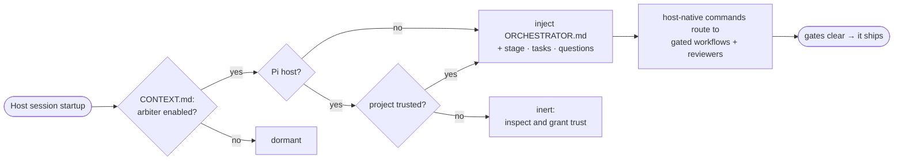
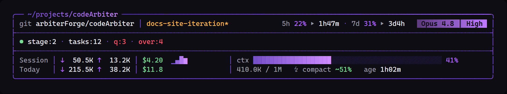

<div align="center">


**Shared enforcement and project-context parity across Claude Code, Codex CLI, and Pi.**

Every intent routes through a gated skill or reviewer agent. Nothing commits until the gates are green. Decisions go through SMARTS. The audit trail is append-only.


### [Read the documentation →](https://arbiterforge.github.io/codeArbiter/)

<sub>Install it globally; it stays dormant until you opt a repo in.</sub>

</div>

---

> **License notice.** As of v2.6.0, codeArbiter is licensed under the [GNU AGPLv3](LICENSE), a change from its earlier MIT license. Copyright (C) 2026 SUaDtL, who reserves the right to dual-license under separate proprietary terms; commercial licenses are not offered at this time. See [Dual-Licensing & Contributions](#dual-licensing--contributions).

## What it is

codeArbiter is a governance layer for Claude Code, Codex CLI, and Pi. It lives in a repository of
four sibling plugins: the three governance hosts (`ca`, `ca-codex`, and `ca-pi`) plus the
`ca-sandbox` infrastructure plugin. The governance adapters are generated from one shared surface
and enforce one checked-in `.codearbiter/` project store. Instead of letting the model freelance,
you drive through host-native commands. Each one routes to the process that owns the work and clears
its gates before anything ships.

The Codex path was live-verified on **Codex CLI 0.144.1** with trusted SessionStart injection and a
real `[H-03]` PreToolUse block. See the
[Claude Code + Codex evidence](https://arbiterforge.github.io/codeArbiter/getting-started/claude-code-and-codex/)
for the dated proof, CI coverage, and intentional host differences.

**Who it's for:** teams and power users who let agents write real code and need to prove what happened.

It will not:

- write feature code before a failing test exists,
- commit on a red suite or without the commit gate,
- resolve an open question by guessing, or
- silently reconcile a contradiction between your docs and your code.

The gates are terse and non-negotiable. The thinking is not: it brainstorms a spec, works through a bug, and weighs a decision with you conversationally. When it enforces, it states the rule and holds the line.

The gates scale to the change: a one-line docs fix takes the small lane or `/ca:chore`, not the full spec-to-PR march. The weight exists because the failure mode of an eager AI assistant is *plausible-but-wrong work that ships*, and the gates make that hard.

## See it catch something

The first time codeArbiter blocks you, it can feel like friction, until you see what it caught. This exchange is a real one from this project's own history: a bug fix forced through test-first, then a PR held at review until an untested seam got covered.

```text
you      /ca:fix the statusline keeps running the old version after an update

arbiter  Routing to tdd (bug variant): a regression test before any fix.
         → writes a failing test, confirms it's red for the right reason
         → minimal fix → suite green → coverage + lint gates clear

you      /ca:commit
arbiter  commit-gate: ✓ permission ✓ branch ✓ tests ✓ secrets
         ✓ behavioral proof ✓ clean diff → committed.

you      /ca:pr
arbiter  reviewer fleet over the diff: coverage-auditor flags an untested seam.
         BLOCK. Here's the gap. → (you resolve, re-run) → PR opened.
```

Every step is a gate you watch clear. You stay in the driver's seat; the gates keep the work honest.

## Install

codeArbiter self-hosts its plugins from this repository. Install the host adapter you use; all three
governance hosts read the same `.codearbiter/` project state.

### Claude Code

```text
/plugin marketplace add arbiterForge/codeArbiter
/plugin install ca@codearbiter
```

Hooks, commands, agents, and statusline wiring load automatically; everything resolves under the `/ca:` namespace.

### Codex

The public GitHub-slug flow is **available now**. It was verified against release `v2.8.13` with
`ca-codex 0.2.4`:

```text
codex plugin marketplace add arbiterForge/codeArbiter
codex plugin add ca-codex@codearbiter
```

Open `/hooks`, review and trust the `ca-codex` handlers, then start a fresh thread. Commands use the
`$ca-*` spelling. Run `$ca-init` to opt a repository in and `$ca-doctor` to prove the hooks are live.

For development against an unpublished checkout, use the local-clone flow:

```text
git clone https://github.com/arbiterForge/codeArbiter
cd codeArbiter
codex plugin marketplace add .
codex plugin add ca-codex@codearbiter
```

### Pi

Pi distribution is Git-only. Pin the independent `ca-pi` release tag, then inspect the installed
source and enabled resources:

```text
pi install git:github.com/arbiterForge/codeArbiter@ca-pi-v<version>
pi list
pi config
```

Pi 0.80.5 and Pi 0.80.10 are the supported hosts for this release line. `ca-pi` also requires Node
22.19+ and Python 3. After inspecting the project, grant Pi project trust, start a fresh session,
then run `/ca-init` and `/ca-doctor`. Generated aliases use `/ca-*`; `/skill:ca-*` is the native
fallback. The [Pi parity runbook](./docs/pi-parity-testing.md) covers isolated installation, live
verification, uninstall, and the scope of the module-identity diagnostic. There is no npm release.

Pi's generated human-readable skill catalog is `plugins/ca-pi/SKILLS.md`, outside the
loader-scanned `skills/` directory. Before the platform aggregate runs any fixture, it checks the
resolved tools workspace; a cold checkout exits with `missing_prerequisite` and directs you to
`npm --prefix plugins/ca-pi/tools ci --ignore-scripts` rather than installing dependencies itself.

**Prerequisites:** Python 3 on `PATH`. Pi installs its final TypeScript wrappers before bridge
readiness, so a missing interpreter blocks mutating calls and points to `/ca-doctor`; Claude Code
and Codex host shims surface an interpreter breadcrumb instead of silently disabling governance.
Also set `git config user.email` (overrides and ADRs are attributed to
that identity). Full version matrix: [Compatibility](https://arbiterforge.github.io/codeArbiter/getting-started/compatibility/).
The optional <kbd>/ca:statusline</kbd> command writes the statusline entry into your
global `~/.claude/settings.json` (it backs up what was there and restores it on removal).

<details>
<summary><b>Install from a local clone</b> (for hacking on it)</summary>

<br>

```sh
git clone https://github.com/arbiterForge/codeArbiter
```
```text
/plugin marketplace add ./codeArbiter
/plugin install ca@codearbiter
```

</details>

## Enable codeArbiter in a repo

Installing a governance plugin does nothing until you opt a repo in. That silence is intentional.
Open the repo and run <kbd>/ca:init</kbd> in Claude Code, <kbd>$ca-init</kbd> in Codex, or
<kbd>/ca-init</kbd> in Pi. It scaffolds
`.codearbiter/` with `arbiter: enabled`
and routes you to the right populator for your situation:

| You have… | /ca:init routes to | What it does |
|---|---|---|
| an existing codebase | <kbd>/ca:create-context</kbd> | back-fills `.codearbiter/` from the source already there |
| a new project, no code yet | <kbd>/ca:decompose</kbd> | a layered interview that scaffolds `.codearbiter/` (it's thorough; expect a long, resumable Q&A) |

Once `.codearbiter/CONTEXT.md` carries the `<!--INITIALIZED-->` marker, you're in normal operation: the next session opens with the orchestrator active and the startup state presented. From there, everything flows through commands.

## How it works

The `ca` plugin uses Claude Code's <kbd>/ca:feature</kbd> command namespace. The `ca-codex` sibling
exposes the generated surface as <kbd>$ca-feature</kbd>, <kbd>$ca-commit</kbd>, and
<kbd>$ca-commands</kbd>. Pi uses <kbd>/ca-feature</kbd> aliases with
<kbd>/skill:ca-feature</kbd> as its native fallback. All three adapters load the same policy core.

Activation is **per-repo and explicit**. Claude Code and Codex use `SessionStart`; Pi uses its
`session_start` extension event. Each checks `.codearbiter/CONTEXT.md` for `arbiter: enabled` before
injecting the orchestrator and live startup state. Pi additionally requires an affirmative host
project-trust decision and a fresh session. Without the marker (or without required Pi trust), the
global install stays before the repository-aware boundary.

The first session of each local day also opens with a read-only repo-hygiene briefing: branch drift against the remote, merged-but-unpruned branches, stale worktrees, and uncommitted or stashed work, all surfaced, never acted on. The full briefing fires **once per day**; later sessions that day stay quiet, with a single-line offer (`run /ca:standup`) only if something is actionable, and **nothing at all when the repo is clean**. The briefing only *reports*; <kbd>/ca:standup</kbd> is the separate command that performs the cleanups under per-action confirmation (ff-only pull on a clean tree, branch and worktree pruning, never the default branch).



On Claude Code, the same flag also gates the optional statusline. Codex has no statusline surface;
its SessionStart briefing presents the governance state instead. ca-pi installs its rich footer in
every interactive parent repository. The governance row appears only when the repository is enabled
and affirmatively trusted; rate-window telemetry is omitted rather than fabricated.

Pi execute mode asks before governed mutations and external side effects. Plan mode is read-only
except for the current canonical spec, plan, and plan ledger. Background jobs are bounded and
session-only: they terminate at session switch or shutdown and are never restored from Pi session
entries. Unverified cleanup marks the manager unhealthy, blocks later launches, and points to
`/ca-doctor`. Footer, permission, plan, and background surfaces are parent-interactive only and do
not recurse into hardened children.

Project state lives in **your** repo, not the plugin: a single `.codearbiter/` directory at the repo root, so stage, specs, plans, ADRs, the decision log, tribunal reports, and the overrides audit trail commit alongside your code and survive uninstalling the plugin.

<table>
<tr><th align="left">Lands in a consumer repo</th><th align="left">Lives elsewhere</th></tr>
<tr>
<td valign="top">

Just `.codearbiter/`, nothing else

</td>
<td valign="top">

The host plugin cache (`~/.claude/…` or `~/.codex/…`)

</td>
</tr>
</table>

Three features extend what the plugin tracks across a session. [Provenance and context drift](https://arbiterforge.github.io/codeArbiter/concepts/provenance-drift/): derived docs record their sources; stale derivations surface at `SessionStart` and the commit gate auto-heals them. [Just-in-time context injection](https://arbiterforge.github.io/codeArbiter/concepts/jit-context-injection/): on a read of a governed file, the controlling decision or spec is surfaced at the point of touch. [Board transitions land with the work](https://arbiterforge.github.io/codeArbiter/concepts/hardening-history/): `/ca:task` flips ride the work commit (ADR-0008), not a separate trailing chore.

## The gates

The non-negotiables codeArbiter enforces in every enabled repo:

- **No feature code before `tdd` Phase 1**: a failing test comes first.
- **No commit without `commit-gate`**, and never on a red suite. "It looks good" is not permission.
- **No `[CONFIRM-NN]` resolved by guessing**: the question is surfaced and work stops.
- **No silent reconciliation** of a conflict between persona, docs, and code; it routes to `/ca:conflict`.
- **No direct-to-`main`, no force-push**: all changes via branch/PR.
- **ADRs only via `/ca:adr`**, with explicit user attribution; an ADR with a `governs:` field pushes back at edit time on the files it constrains.
- **Every `/ca:override`, `/ca:dev` session, and small-lane triage call is logged** to append-only audit logs the hooks mechanically protect from rewrite.

When rules pull apart, they resolve by a fixed hierarchy (security & audit-trail correctness first, then data integrity, maintainability, performance, velocity), and a non-obvious tradeoff cites the level it was made at.

## Commands

Every intent flows through a command; direct off-channel instructions get redirected to the catalog.
Claude's `/ca:*` catalog is in [`plugins/ca/COMMANDS.md`](./plugins/ca/COMMANDS.md). Codex uses the
generated `$ca-*` catalog in [`plugins/ca-codex/COMMANDS.md`](./plugins/ca-codex/COMMANDS.md), and
Pi uses the generated alias catalog in [`plugins/ca-pi/COMMANDS.md`](./plugins/ca-pi/COMMANDS.md).
The generated counts are `ca: 39`, `ca-codex: 37`, and `ca-pi: 38`. Codex omits `statusline` and
`prune`; Pi omits only `statusline` and implements prune through native compaction.

| Command | Purpose |
|---|---|
| <kbd>/ca:feature "desc"</kbd> | Spec-driven feature: brainstorm → plan → test-first build → commit → finish. **The only path to implementation.** |
| <kbd>/ca:sprint "goal"</kbd> | **Autonomous sprint.** One interactive spec gate, then plan-to-PR execution, every auto-decision SMARTS-scored and logged with a confidence flag for your morning review. Security, irreversible ops, and merges still stop for you. |
| <kbd>/ca:fix "bug"</kbd> | Regression-test-first defect fix. |
| <kbd>/ca:commit</kbd> | The only path to a commit; routes through the nine-gate `commit-gate`. |
| <kbd>/ca:review</kbd> | Dispatch the reviewer fleet over the diff; BLOCK on CRITICAL/HIGH. |
| <kbd>/ca:adr "title"</kbd> | Author a numbered, user-attributed Architecture Decision Record. |
| <kbd>/ca:status</kbd> | Stage, open tasks, unresolved `CONFIRM-NN`, overrides since checkpoint. |
| <kbd>/ca:audit</kbd> | One command, one packet: every commit, override, ADR, and autonomous decision in a window, with attribution: the document an auditor actually asks for. |
| <kbd>/ca:metrics</kbd> | Read-only trend glance: override rate, small-lane rate, and sprint low-confidence ratio, each with a direction arrow vs. the prior 20-commit window. |

<details>
<summary><b>The full catalog</b>: 39 commands</summary>

<br>

**Implementation**

| Command | Purpose |
|---|---|
| `/ca:feature "desc"` | Spec-driven feature: the only entry to implementation; a logged small lane skips ceremony for small changes |
| `/ca:sprint "goal"` | Autonomous sprint: one spec gate, then plan-to-PR with every auto-decision logged |
| `/ca:fix "bug"` | Regression-test-first defect fix |
| `/ca:refactor "surface"` | Behavior-preserving restructure behind a parity-coverage gate |
| `/ca:debug "symptom"` | Investigate-then-decide root-cause analysis |
| `/ca:chore <docs\|deps\|revert>` | Non-behavioral lane: docs edits, dependency bumps, reverts; type-scaled gates |
| `/ca:spike "question"` | Throwaway exploration on a `spike/*` branch; never merges, exits to a findings note or `/ca:feature` |

**Commit &amp; ship**

| Command | Purpose |
|---|---|
| `/ca:commit` | The only path to a commit; routes through `commit-gate` |
| `/ca:pr` | Open / finish a branch; no direct-to-default |
| `/ca:watch <PR>` | Watch a PR's CI server-side: diagnose on red, notify and offer merge on green; never auto-merges |
| `/ca:review [path]` | Reviewer-fleet pass over the diff; BLOCK on CRITICAL/HIGH |
| `/ca:checkpoint` | Lean periodic multi-reviewer sweep |
| `/ca:tribunal [scope-path]` | Deep, rarely-run whole-codebase audit across eleven specialist lenses; one file per finding plus append-only run/triage logs, resumable from disk; files GitHub issues on approval; never a required gate |
| `/ca:release [--dry-run]` | SemVer bump + changelog + annotated tag |
| `/ca:add-dep "pkg"` | Vet a dependency (license, provenance, supply chain) |

**Decisions**

| Command | Purpose |
|---|---|
| `/ca:adr "title"` | Author a numbered, user-attributed ADR |
| `/ca:adr-status [--adr N]` | List/inspect ADR status and supersede chains |
| `/ca:reconcile ["scope"]` | Reconcile artifacts vs. scaffold via SMARTS |
| `/ca:conflict "description"` | Stop all work and surface a rule conflict |
| `/ca:threat-model "scope"` | Optional lightweight STRIDE pass |

**Project &amp; meta**

| Command | Purpose |
|---|---|
| `/ca:decompose` | Greenfield: layered interview to populate `.codearbiter/` |
| `/ca:create-context` | Brownfield: back-fill `.codearbiter/` from source |
| `/ca:init` | Scaffold the `.codearbiter/` state store |
| `/ca:status` | Maturity, open tasks, unresolved `CONFIRM-NN`, overrides |
| `/ca:task` | Task-board writer: add a queued task, start one (mints a dotted ID, stamps the date), or mark one done. The only blessed write to `open-tasks.md` |
| `/ca:statusline` | Install/wire the codeArbiter statusline |
| `/ca:doctor` | Prove the install is enforcing: payload, cache staleness, live-fire hook probe |
| `/ca:preview` | Zero-onboarding read-only dry-run of the reviewer fleet on the current diff: predicts reviewers, runs the state-free secret scan, writes nothing |
| `/ca:context-check` | Optional manual drift audit: report stale provenance-tracked docs, then per stale doc offer re-scout, re-baseline, or defer; not the daily loop, `commit-gate` auto-heal owns routine maintenance |
| `/ca:standup` | Daily hygiene: review repo state, then ff-only pull / prune merged branches / remove stale worktrees / surface stashes, each under per-action confirmation |
| `/ca:new-skill "gap"` | Author a new skill after the gap is proven uncovered |
| `/ca:btw "question"` | Lightweight Q&amp;A; no state change |
| `/ca:override "reason"` | Sanctioned, logged single-identity gate bypass |
| `/ca:audit [range]` | Assemble the governance packet for a window into `.codearbiter/audits/`; read-only |
| `/ca:metrics [--window N]` | Read-only trend glance: override rate, small-lane rate, sprint low-confidence ratio, each with a direction arrow vs. the prior 20-commit window |
| `/ca:prune [status\|dry\|run\|audit\|on\|off]` | Trim transcript clutter to extend session lifetime; dry-run by default, gains land at resume/compaction |
| `/ca:commands` | Show the catalog |

**Maintainer**

| Command | Purpose |
|---|---|
| `/ca:dev ["note"]` | Suspend orchestration to edit codeArbiter itself; requires `CODEARBITER_DEV=1`, entry/exit logged to `overrides.log` |
| `/ca:arbiter` | Exit dev mode: restore orchestration, log the exit |

</details>

## Decisions go through SMARTS

When the arbiter hits an architectural fork, such as two `accepted` ADRs that disagree or a spec that says one thing while the scaffold does another, it does not pick for you and it does not hand you a naked "A or B?" Every option is scored through **SMARTS** (Scalable, Maintainable, Available, Reliable, Testable, Securable), a fixed six-lens evaluation, and the choice it presents carries that analysis with it.

Each lens gets one cell per option: a verdict (`Strong`, `Adequate`, `Weak`, or `Indifferent`) plus at most 20 words of justification citing a specific property or failure mode, never "industry standard." That is what lands in front of you, a table, not an opinion:

| Lens | Bundle the auth engine | Customer-provided |
|---|---|---|
| Scalable | Adequate. Sub-ms decisions sufficient at 50-user scale. | Adequate. Same ceiling, adds a network hop. |
| Maintainable | Strong. One package owns versioning and integration. | Weak. Two release cycles must coordinate. |
| Available | Strong. Available whenever the system is. | Weak. Depends on customer infrastructure. |
| Reliable | Strong. Failure contained in the deployment boundary. | Weak. Failure surface includes customer network. |
| Testable | Strong. Local test env is one package install. | Weak. Requires standing up two services. |
| Securable | Strong. Self-contained mandate satisfied. | Weak. Cross-service auditing is harder. |

**Recommendation:** Bundle. Strength: **strong**. Securable and Available dominate cleanly, and no lens favors external enough to override.

Every recommendation carries exactly one strength label (`strong`, `moderate`, or `tied`; there is no `weak`) and a `Precedent:` line citing the most similar prior decisions.

**You still decide.** The arbiter recommends; it never records a decision you didn't explicitly make. "Use your best judgment" is declined, because the decision log is append-only and every entry is attributed to a person.

**Autonomy with a paper trail.** <kbd>/ca:sprint</kbd> reuses the same six-lens scoring to decide "as the user" on every non-hard-gate point, logging each call to `.codearbiter/sprint-log.md` with a confidence flag (`high` for `strong`, `low` for `moderate` or `tied`) so you know exactly what to skim in the morning. Security boundaries, irreversible operations, gate bypasses, and an unresolved `[CONFIRM-NN]` still stop and wait for you.

More detail and the full lens definitions: [SMARTS](https://arbiterforge.github.io/codeArbiter/concepts/smarts/) and [Autonomous sprints](https://arbiterforge.github.io/codeArbiter/guides/autonomous-sprints/).

## Claude Code statusline

codeArbiter ships a token-aware statusline. Wire it in with <kbd>/ca:statusline</kbd>:

<div align="center"></div>

The folder, git/diff, rate limits, token usage, cost, and context segments render in every repo; the arbiter row (stage · tasks · open questions · overrides-since-checkpoint) lights up only in an enabled repo. Token counts come from the session transcript and the **cost is Claude Code's own `cost.total_cost_usd`** (what you actually pay); the context bar shifts toward red as you near compaction, the model pill carries the active model **and** its effort level, and session age sits beside the compaction headroom.

Remove it any time with <kbd>/ca:statusline</kbd>; it backs up and restores whatever statusline you had before.

## Staying up to date

codeArbiter self-hosts a **third-party** marketplace, and Claude Code's native plugin auto-update is
enabled by default only for official Anthropic marketplaces: it's **off by default** for a
third-party one like this. The official update mechanism is still the native one; you just have to
turn it on:

```text
/plugin marketplace update codearbiter
```

Run that whenever you want the latest release, or check whether your marketplace auto-updates are
enabled via `/plugin`. Release notes: [Changelog](https://arbiterforge.github.io/codeArbiter/changelog/).

Because that's opt-in, codeArbiter also checks for you: at session start (and in the statusline), it
surfaces a one-line notice when a newer release is published:

```text
codeArbiter: update available 2.8.11 -> 2.10.0 (run /plugin marketplace update codearbiter)
```

That check is one of exactly two background network touches the plugin makes (see
[What's inside](#whats-inside) for the other, a local `git fetch`): a best-effort, **once-a-day**,
fail-silent, unauthenticated HTTPS GET to the GitHub Releases API, no repo data sent, cached to a
small user-global file. It never blocks session start; it refreshes off to the side, so a slow or
unreachable network never delays your session, and it stays silent if the check fails or you're
already current. It only ever *tells* you; it never applies an update itself.

## Configuration

Every optional behavior is **off by default** and opt-in through an environment variable. codeArbiter never enables one on your behalf. Set them in your shell profile (or per session) to turn them on.

| Variable | Default | Effect |
|---|---|---|
| `CODEARBITER_BABYSIT` | `off` | When `on`, <kbd>/ca:pr</kbd> auto-attaches a CI watcher to the PR it opens (same as running <kbd>/ca:watch</kbd> by hand). Ad-hoc <kbd>/ca:watch</kbd> works regardless. |
| `CODEARBITER_BABYSIT_ONRED` | `propose` | The watcher's depth on a red check: `propose` (name the cause, suggest a fix, touch nothing) or `branch` (additionally stage the fix on an unmergeable `spike/fix-*`). |

Every flag is shipped off, never auto-enabled, and dormant in a repo without `arbiter: enabled`. Preview features carry their own opt-ins; see [Feature Forge](#feature-forge) below.

## Feature Forge

<div align="center"></div>

Some features are built, tested, and shipping in the box, but not yet *blessed*. They live in the **Feature Forge**: off by default, fully dormant until you opt in, and labeled `preview` until real-world data earns them a promotion to a stable release. Nothing here touches your repo or your gates unless you turn it on. A preview graduates when real-world evidence says it's ready; each feature below names how to send that evidence back. Full detail: [What's in the Forge](https://arbiterforge.github.io/codeArbiter/feature-forge/whats-in-the-forge/).

| Feature | Opt-in | Status | How to help it graduate |
|---|---|---|---|
| Live transcript pruning | `CODEARBITER_PRUNE=dry` | `preview` | run `dry`, send the log |
| Pluggable execution farm | <kbd>/ca:sprint --farm</kbd> | `preview` | run it on a real sprint, report results |
| ca-sandbox (local Codespace) | install the `ca-sandbox` plugin | `preview` | explore real repos in it; run `--with-claude` and report |

**Live transcript pruning.** Long sessions bloat the transcript until Claude Code compacts early and you lose working headroom; `CODEARBITER_PRUNE=dry` computes every prune it would make and logs the evidence without touching your transcript. It's preview because the `dry → on` go/no-go needs that real-session evidence first. Details and tuning knobs: [What's in the Forge](https://arbiterforge.github.io/codeArbiter/feature-forge/whats-in-the-forge/).

#### Pluggable execution farm

**What it does.** <kbd>/ca:sprint --farm</kbd> runs the implementation step through a `Worker` seam in isolated git worktrees under the same hard gates, instead of a premium subagent. The cheap HTTP-chat worker ships today; the seam is built to admit **premium and agentic** workers behind the same gates (roadmap, not yet built). The worker prompt is enriched with the failing-test source and in-scope files, byte-capped and secret-redacted before transmission. Claude still writes the spec, failing tests, and plan, and **every green task still routes through the full spec-compliance + quality + fresh-verification chain**: a worker can pass the gates, never redefine them.

**Opt-in.** <kbd>/ca:sprint --farm</kbd> (needs `FARM_API_KEY`).

| Variable | Default | Purpose |
|---|---|---|
| `FARM_API_KEY` | _(required)_ | OpenAI-compatible provider key; never committed, never in audit files. |
| `FARM_MODEL` | _(unset)_ | Skip selection; otherwise the model is auto-selected by measured canary at dispatch. |
| `FARM_ENRICH_MAX_BYTES` | `131072` | Cap on test-source + in-scope context injected into the worker prompt (redacted for secrets). |
| `FARM_CONCURRENCY` | `4` | Max concurrent task workers. |
| `FARM_SAMPLES` | `1` | Parallel candidate draws per task, each in its own scratch worktree; the first to pass the gate is accepted. `FARM_SAMPLES=1` is byte-for-byte the single-candidate path. Total in-flight workers never exceed `FARM_CONCURRENCY`. |
| `FARM_TEMPERATURE` | `0` | Sampling temperature; auto-bumped to `0.7` when `FARM_SAMPLES>1` so samples diversify. Set explicitly to override. |
| `FARM_MAX_TOKENS` | _(unset)_ | Token ceiling per worker call; unset defers to the provider default. |

**Best-of-N sampling.** Because the gate is a deterministic pass/fail oracle, `FARM_SAMPLES` candidates are drawn in parallel and the first to pass is accepted; the N-fold token cost is recorded in `farm-report.json`.

Full config (endpoint, retries, circuit breaker, mutation guard, sovereignty note) is in <kbd>/ca:sprint</kbd> and the farm setup doc. It's preview because it is not yet validated on real runs; the promotion bar is the open question `CONFIRM-05`. **Help promote it:** run a real <kbd>/ca:sprint --farm</kbd> and report back the per-task pass rates and any gate escapes you see.

Pi keeps `--farm` at the same `preview` level and calls the one checked-in `farm.js` backend through
its trusted parent extension. A Pi-native embedded farm worker is a future spike, not a shipping
dependency or a second engine. npm packaging for `ca-pi` is also a future spike; today it installs
from pinned Git tags only.

**ca-sandbox (local Codespace).** A locally-hosted GitHub-Codespace equivalent, shipped as a sibling plugin per ADR-0007: pull a repo you're curious about, including untrusted code, into an ephemeral, isolated Docker container. Your host filesystem is never mounted in (no bind mounts, no docker socket, never `--privileged`), and getting work back out is a host-initiated `cp` only. It ships with a full automated suite green, but the `--with-claude` path (running Claude Code inside the box) is verified only against a dummy token, not yet a real interactive session, so it stays preview until real-world runs earn it a promotion. **Help promote it:** explore real repos in it and report how `--with-claude` behaves in a real session. Install: the `ca-sandbox` plugin from the marketplace, then `/ca-sandbox:sandbox create <repo-url>`. Details: [`plugins/ca-sandbox/README.md`](./plugins/ca-sandbox/README.md).

## What's inside

```text
.claude-plugin/marketplace.json     Claude marketplace
.agents/plugins/marketplace.json    Codex marketplace
plugins/ca/                         the governance plugin (CLAUDE_PLUGIN_ROOT)
├── .claude-plugin/plugin.json
├── README.md                       plugin-directory summary (this file is the long form)
├── ORCHESTRATOR.md                 always-on persona, injected by the SessionStart hook
├── COMMANDS.md                     command catalog (+ user-facing glossary)
├── SPRINT.md                       /ca:sprint mode body — the autonomous-sprint procedure
├── commands/   (39)   skills/   (22)   agents/   (28)
├── includes/                       routing-table · reference-map · redirect · farm setup (loaded on demand)
├── hooks/                          session-start (activation linchpin) · pre/post gates · statusline → docs/hooks.md
└── tools/                          farm dispatcher (farm.js + TypeScript source and tests)
plugins/ca-sandbox/                 the local-Codespace plugin (Feature Forge, preview)
plugins/ca-codex/                   Codex sibling: generated skills + shared hook core
plugins/ca-pi/                      Pi sibling: generated policy + TypeScript adapter + built extensions
```

**Skills** encode gated processes: `tdd`, `commit-gate`, `decision-variance`/SMARTS, `debug`, `refactor`, and the dynamic brainstorm → plan → execute workflow layer. **Agents** are the dispatched reviewers and authors: security, auth/crypto, dependency, migration, coverage, and architecture-drift reviewers, the design-quality reviewer, plus the backend/frontend/infra authors and the scout/grader/triage plumbing.

**Hooks** are how the plugin stays active in your repo, and they run code on your machine, so they're documented in full: [`docs/hooks.md`](./docs/hooks.md) (also mirrored at [/hooks/](https://arbiterforge.github.io/codeArbiter/hooks/)) covers every hook, exactly what it reads and writes, and names the only two things any hook sends over a network: a detached local `git fetch` against your own remote, and a once-a-day fail-silent read of the GitHub Releases API (see [Staying up to date](#staying-up-to-date)). Neither blocks a hook, and no repo data leaves your machine either way.

## Turning it off

codeArbiter is dormant by default: a repo without `.codearbiter/CONTEXT.md` → `arbiter: enabled`
never sees the orchestrator persona and never routes through a gate. Remove `ca` with Claude Code's
plugin manager, run `codex plugin remove ca-codex@codearbiter` for Codex, or use `pi remove` with
the pinned Git source for Pi. Either way, `.codearbiter/` survives, so another governance host can
keep using the same specs, ADRs, and audit trail.
Full walkthrough: [Uninstalling](https://arbiterforge.github.io/codeArbiter/guides/uninstalling/).

## Project history

codeArbiter v2 is a ground-up rebuild: from a ~13,600-line `.agents/` + vendoring framework into a native Claude Code plugin. The full story is in [`CHANGELOG.md`](./CHANGELOG.md) and the [site changelog](https://arbiterforge.github.io/codeArbiter/changelog/). The v1 framework is preserved in this repository's early commit history for reference.

## License

codeArbiter is licensed under the [GNU Affero General Public License v3.0](./LICENSE) (AGPLv3). You may use, study, modify, and redistribute it under those terms. Because AGPLv3 covers network use (section 13), running a modified version as a hosted service obligates you to offer that version's complete source under the same license.

The AGPLv3 transition applies from v2.6.0 forward. Earlier releases, through the last MIT-tagged commit, remain available under the MIT license they shipped with.

## Dual-Licensing & Contributions

**Open source.** codeArbiter is available under AGPLv3 for open-source use, free of charge.

**Commercial licensing.** The copyright holder (SUaDtL) retains sole ownership and reserves the right to offer the project under separate proprietary terms. Commercial licenses are not being offered at this time. If you have a use case that AGPLv3 does not fit, you may send an inquiry through GitHub (open an issue or reach the repository owner), and it will be considered if and when a commercial-licensing path is established.

**Contributions.** Future community contributions require a Contributor License Agreement granting the copyright holder the right to relicense the contribution under both AGPLv3 and proprietary terms, which is what keeps the dual-licensing model intact. See [CLA.md](./CLA.md). That CLA is a template pending legal review and is not yet in force.

<div align="center"><sub>Built for Claude Code, Codex CLI, and Pi.</sub></div>
