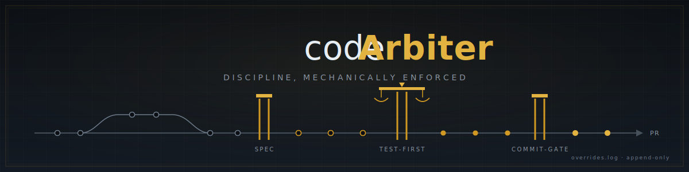
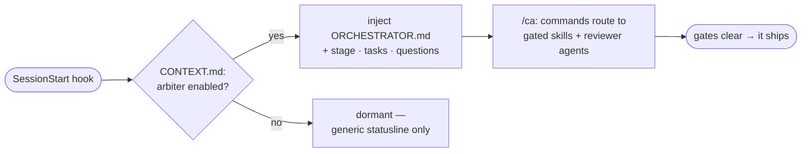
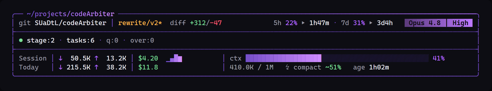

<div align="center">



**An orchestration layer for Claude Code that refuses to freelance.**

Every intent routes through a gated skill or reviewer agent. Nothing commits until the gates are green. Decisions go through SMARTS. The audit trail is append-only.


<sub>Install it globally; it stays dormant until you opt a repo in.</sub>

</div>

---

## What it is

codeArbiter is a native Claude Code plugin that sits between you and your codebase. Instead of letting the model freelance, you drive through slash commands. Each one routes to the skill or agent that owns the work — TDD, the commit gate, decision-variance/SMARTS, the reviewer fleet — and clears its gates before anything ships.

It will not:

- write feature code before a failing test exists,
- commit on a red suite or without the commit gate,
- resolve an open question by guessing, or
- silently reconcile a contradiction between your docs and your code.

It is decisive and terse by design. If you want an assistant that hedges, this is the wrong tool.

## How it works

One plugin, named `ca`. Claude Code namespaces every plugin command, so you invoke it as <kbd>/ca:feature</kbd>, <kbd>/ca:commit</kbd>, <kbd>/ca:commands</kbd>, and so on.

Activation is **per-repo and explicit**. A `SessionStart` hook checks the repo for `.codearbiter/CONTEXT.md` carrying the frontmatter flag `arbiter: enabled`. Present → it injects the orchestrator persona and live startup state. Absent → it exits silently. Install the plugin globally and it stays out of the way everywhere you haven't opted in.

The first session of each day also opens with a read-only repo-hygiene briefing — branch drift against the remote, merged-but-unpruned branches, stale worktrees, and uncommitted or stashed work — surfaced, never acted on. <kbd>/ca:standup</kbd> then performs the cleanups under per-action confirmation (ff-only pull on a clean tree, branch and worktree pruning, never the default branch). Later sessions that day collapse to a single-line offer.



The same flag gates the statusline: the usage/context segment renders everywhere; the arbiter segments light up only in an enabled repo.

Project state lives in **your** repo, not the plugin — a single `.codearbiter/` directory at the repo root, so stage, specs, plans, ADRs, the decision log, and the overrides audit trail commit alongside your code and survive uninstalling the plugin.

<table>
<tr><th align="left">Lands in a consumer repo</th><th align="left">Lives elsewhere</th></tr>
<tr>
<td valign="top">

`.codearbiter/` &nbsp;— and nothing else

</td>
<td valign="top">

The plugin itself → `~/.claude/plugins/cache/`

</td>
</tr>
</table>

## Install

codeArbiter self-hosts a single-plugin marketplace from this repo.

```text
/plugin marketplace add SUaDtL/codeArbiter
/plugin install ca@codearbiter
```

Hooks, commands, agents, and statusline wiring load automatically; everything resolves under the `/ca:` namespace.

**Prerequisites:** Python 3 on `PATH` (every hook is Python — without it the gates and the startup
injection silently don't run) and `git config user.email` set (overrides and ADRs are attributed to
that identity). The optional <kbd>/ca:statusline</kbd> command writes the statusline entry into your
global `~/.claude/settings.json` (it backs up what was there and restores it on removal).

<details>
<summary><b>Install from a local clone</b> (for hacking on it)</summary>

<br>

```sh
git clone https://github.com/SUaDtL/codeArbiter
```
```text
/plugin marketplace add ./codeArbiter
/plugin install ca@codearbiter
```

</details>

## Enable codeArbiter in a repo

Installing the plugin does nothing until you opt a repo in — that silence is intentional. Open the
repo in Claude Code and run <kbd>/ca:init</kbd>: it scaffolds `.codearbiter/` with `arbiter: enabled`
and routes you to the right populator for your situation:

| You have… | /ca:init routes to | What it does |
|---|---|---|
| an existing codebase | <kbd>/ca:create-context</kbd> | back-fills `.codearbiter/` from the source already there |
| a new project, no code yet | <kbd>/ca:decompose</kbd> | a layered interview that scaffolds `.codearbiter/` (it's thorough — expect a long, resumable Q&A) |

Once `.codearbiter/CONTEXT.md` carries the `<!--INITIALIZED-->` marker, you're in normal operation: the next session opens with the orchestrator active and the startup state presented. From there, everything flows through commands.

## Statusline

codeArbiter ships a token-aware statusline. Wire it in with <kbd>/ca:statusline</kbd>:

<div align="center"></div>

The folder, git/diff, rate limits, token usage, cost, and context segments render in every repo; the arbiter row (stage · tasks · open questions · overrides-since-checkpoint) lights up only in an enabled repo. Token counts come from the session transcript and the **cost is Claude Code's own `cost.total_cost_usd`** (what you actually pay); the context bar shifts toward red as you near compaction, the model pill carries the active model **and** its effort level, and session age sits beside the compaction headroom.

Remove it any time with <kbd>/ca:statusline</kbd> — it backs up and restores whatever statusline you had before.

## Configuration

Every optional behavior is **off by default** and opt-in through an environment variable — codeArbiter never enables one on your behalf. Set them in your shell profile (or per session) to turn them on.

| Variable | Default | Effect |
|---|---|---|
| `CODEARBITER_BABYSIT` | `off` | When `on`, <kbd>/ca:pr</kbd> auto-attaches a CI watcher to the PR it opens (same as running <kbd>/ca:watch</kbd> by hand). Ad-hoc <kbd>/ca:watch</kbd> works regardless. |
| `CODEARBITER_BABYSIT_ONRED` | `propose` | The watcher's depth on a red check: `propose` (name the cause, suggest a fix, touch nothing) or `branch` (additionally stage the fix on an unmergeable `spike/fix-*`). |
| `CODEARBITER_PRUNE` | `off` | Transcript-pruner mode: `off`, `dry` (report only), or `on` (trim on resume/compaction). |
| `CODEARBITER_PRUNE_TIER` | — | Which pruning passes run; see <kbd>/ca:prune</kbd>. |
| `CODEARBITER_PRUNE_KEEP_RECENT` | — | Protect the K most recent turns from pruning. |
| `CODEARBITER_PRUNE_MIN_GROWTH` / `CODEARBITER_PRUNE_MAXBYTES` | — | Growth threshold before a prune runs / cap on bytes removed. |

Both feature flags mirror each other's contract: shipped off, never auto-enabled, and dormant in a repo without `arbiter: enabled`.

## Commands

Every intent flows through a command; direct off-channel instructions get redirected to the catalog. The full list is in [`plugins/ca/COMMANDS.md`](./plugins/ca/COMMANDS.md) and via <kbd>/ca:commands</kbd>.

| Command | Purpose |
|---|---|
| <kbd>/ca:feature "desc"</kbd> | Spec-driven feature: brainstorm → plan → test-first build → commit → finish. **The only path to implementation.** |
| <kbd>/ca:sprint "goal"</kbd> | **Autonomous sprint.** One interactive spec gate, then plan-to-PR execution — every auto-decision SMARTS-scored and logged with a confidence flag for your morning review. Security, irreversible ops, and merges still stop for you. |
| <kbd>/ca:fix "bug"</kbd> | Regression-test-first defect fix. |
| <kbd>/ca:commit</kbd> | The only path to a commit; routes through the nine-gate `commit-gate`. |
| <kbd>/ca:review</kbd> | Dispatch the reviewer fleet over the diff; BLOCK on CRITICAL/HIGH. |
| <kbd>/ca:adr "title"</kbd> | Author a numbered, user-attributed Architecture Decision Record. |
| <kbd>/ca:status</kbd> | Stage, open tasks, unresolved `CONFIRM-NN`, overrides since checkpoint. |
| <kbd>/ca:audit</kbd> | One command, one packet: every commit, override, ADR, and autonomous decision in a window, with attribution — the document an auditor actually asks for. |

<details>
<summary><b>The full catalog</b> — 34 commands</summary>

<br>

**Implementation**

| Command | Purpose |
|---|---|
| `/ca:feature "desc"` | Spec-driven feature — the only entry to implementation; a logged small lane skips ceremony for small changes |
| `/ca:sprint "goal"` | Autonomous sprint — one spec gate, then plan-to-PR with every auto-decision logged |
| `/ca:fix "bug"` | Regression-test-first defect fix |
| `/ca:refactor "surface"` | Behavior-preserving restructure behind a parity-coverage gate |
| `/ca:debug "symptom"` | Investigate-then-decide root-cause analysis |
| `/ca:chore <docs\|deps\|revert>` | Non-behavioral lane — docs edits, dependency bumps, reverts; type-scaled gates |
| `/ca:spike "question"` | Throwaway exploration on a `spike/*` branch — never merges; exits to a findings note or `/ca:feature` |

**Commit &amp; ship**

| Command | Purpose |
|---|---|
| `/ca:commit` | The only path to a commit; routes through `commit-gate` |
| `/ca:pr` | Open / finish a branch — no direct-to-default |
| `/ca:watch <PR>` | Babysit a PR's CI server-side — diagnose on red, notify + offer merge on green; never auto-merges |
| `/ca:review [path]` | Reviewer-fleet pass over the diff; BLOCK on CRITICAL/HIGH |
| `/ca:checkpoint` | Lean periodic multi-reviewer sweep |
| `/ca:release [--dry-run]` | SemVer bump + changelog + annotated tag |
| `/ca:add-dep "pkg"` | Vet a dependency (license, provenance, supply chain) |

**Decisions**

| Command | Purpose |
|---|---|
| `/ca:adr "title"` | Author a numbered, user-attributed ADR |
| `/ca:adr-status [--adr N]` | List/inspect ADR status and supersede chains |
| `/ca:reconcile ["scope"]` | Reconcile artifacts vs. scaffold via SMARTS |
| `/ca:conflict "description"` | Stop all work and surface a rule conflict |
| `/ca:threat-model "scope"` | Optional lightweight STRIDE pass |

**Project &amp; meta**

| Command | Purpose |
|---|---|
| `/ca:decompose` | Greenfield: layered interview to populate `.codearbiter/` |
| `/ca:create-context` | Brownfield: back-fill `.codearbiter/` from source |
| `/ca:init` | Scaffold the `.codearbiter/` state store |
| `/ca:status` | Maturity, open tasks, unresolved `CONFIRM-NN`, overrides |
| `/ca:statusline` | Install/wire the codeArbiter statusline |
| `/ca:doctor` | Prove the install is enforcing — payload, cache staleness, live-fire hook probe |
| `/ca:standup` | Daily hygiene — review repo state, then ff-only pull / prune merged branches / remove stale worktrees / surface stashes, each under per-action confirmation |
| `/ca:new-skill "gap"` | Author a new skill after the gap is proven uncovered |
| `/ca:btw "question"` | Lightweight Q&amp;A; no state change |
| `/ca:override "reason"` | Sanctioned, logged single-identity gate bypass |
| `/ca:audit [range]` | Assemble the governance packet for a window into `.codearbiter/audits/` — read-only |
| `/ca:prune [status\|dry\|run\|audit\|on\|off]` | Trim transcript clutter to extend session lifetime; dry-run by default, gains land at resume/compaction |
| `/ca:commands` | Show the catalog |

**Maintainer**

| Command | Purpose |
|---|---|
| `/ca:dev ["note"]` | Suspend orchestration to edit codeArbiter itself — requires `CODEARBITER_DEV=1`; entry/exit logged to `overrides.log` |
| `/ca:arbiter` | Exit dev mode — restore orchestration, log the exit |

</details>

## The gates

The non-negotiables codeArbiter enforces in every enabled repo:

- **No feature code before `tdd` Phase 1** — a failing test comes first.
- **No commit without `commit-gate`**, and never on a red suite. "It looks good" is not permission.
- **No `[CONFIRM-NN]` resolved by guessing** — the question is surfaced and work stops.
- **No silent reconciliation** of a conflict between persona, docs, and code — it routes to `/ca:conflict`.
- **No direct-to-`main`, no force-push** — all changes via branch/PR.
- **ADRs only via `/ca:adr`**, with explicit user attribution — and an ADR with a `governs:` field pushes back at edit time on the files it constrains.
- **Every `/ca:override`, `/ca:dev` session, and small-lane triage call is logged** to append-only audit logs the hooks mechanically protect from rewrite.

When rules pull apart, they resolve by a fixed hierarchy — security & audit-trail correctness first, then data integrity, maintainability, performance, velocity — and a non-obvious tradeoff cites the level it was made at.

## What's inside

```text
.claude-plugin/marketplace.json     single-plugin marketplace → ./plugins/ca
plugins/ca/                         the plugin (CLAUDE_PLUGIN_ROOT)
├── .claude-plugin/plugin.json
├── README.md                       plugin-directory summary (this file is the long form)
├── ORCHESTRATOR.md                 always-on persona, injected by the SessionStart hook
├── COMMANDS.md                     command catalog (+ user-facing glossary)
├── SPRINT.md                       /ca:sprint mode body — the autonomous-sprint procedure
├── commands/   (34)   skills/   (20)   agents/   (14)
├── includes/                       routing-table · reference-map · redirect · farm setup (loaded on demand)
├── hooks/                          session-start (activation linchpin) · pre/post gates · statusline
└── tools/                          farm dispatcher (farm.js + TypeScript source and tests)
```

**Skills** encode gated processes — `tdd`, `commit-gate`, `decision-variance`/SMARTS, `debug`, `refactor`, and the dynamic brainstorm → plan → execute workflow layer. **Agents** are the dispatched reviewers and authors — security, auth/crypto, dependency, migration, coverage, and architecture-drift reviewers, plus the backend/frontend/infra authors and the scout/grader/triage plumbing.

<details>
<summary><b>Why "decisive and terse"?</b></summary>

<br>

codeArbiter is built to be an enforcement layer, not a collaborator that talks you out of the rules. It states, it doesn't hedge; it enforces, it doesn't negotiate. The gates exist because the failure mode of an eager AI assistant is *plausible-but-wrong work that ships*. The orchestrator's job is to make that hard.

</details>

## Project history

codeArbiter v2 is a ground-up rebuild — from a ~13,600-line `.agents/` + vendoring framework into a native Claude Code plugin. The full story is in [`CHANGELOG.md`](./CHANGELOG.md). The v1 framework is preserved on the [`archive/v1`](../../tree/archive/v1) branch for reference.

## License

[MIT](./LICENSE). Use it for anything.

<div align="center"><sub>Built for <a href="https://claude.com/claude-code">Claude Code</a>.</sub></div>
