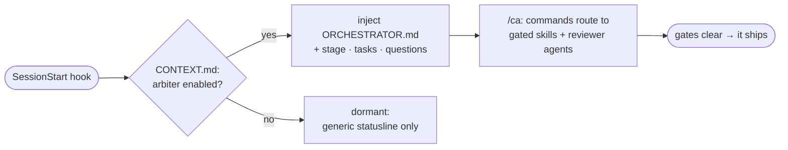
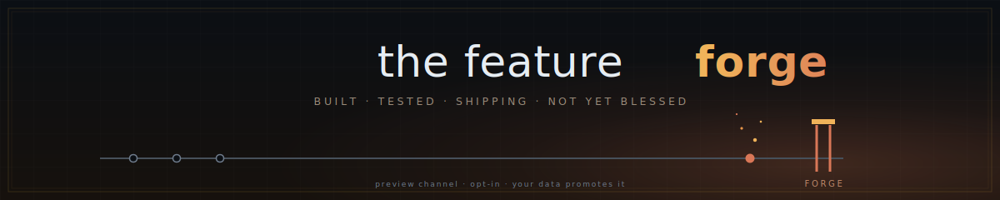

<div align="center">


**An orchestration layer for Claude Code that refuses to freelance.**

Every intent routes through a gated skill or reviewer agent. Nothing commits until the gates are green. Decisions go through SMARTS. The audit trail is append-only.


<sub>Install it globally; it stays dormant until you opt a repo in.</sub>

<!-- DEMO: once recorded, replace this comment with the in-motion GIF. Recording shot list in docs/demo-script.md
<div align="center"></div>
-->

</div>

---

## What it is

codeArbiter is a native Claude Code plugin that sits between you and your codebase. Instead of letting the model freelance, you drive through slash commands. Each one routes to the skill or agent that owns the work (TDD, the commit gate, decision-variance/SMARTS, the reviewer fleet) and clears its gates before anything ships.

**Who it's for:** teams and power users who let agents write real code and need to prove what happened. The kind who'd rather a tool block than apologize.

It will not:

- write feature code before a failing test exists,
- commit on a red suite or without the commit gate,
- resolve an open question by guessing, or
- silently reconcile a contradiction between your docs and your code.

The gates are terse and non-negotiable. The thinking is not. It brainstorms a spec, works through a bug, and weighs a decision with you conversationally. When it enforces, it states the rule and holds the line.

Is that a lot of ceremony? It scales to the change. The heavyweight gates are what a skimmer notices first, but a one-line docs fix takes the small lane or `/ca:chore`, not the full spec-to-PR march. The weight is there because the failure mode of an eager AI assistant is *plausible-but-wrong work that ships*, and the gates exist to make that hard.

### Why the pushback is the point

The first time codeArbiter blocks you, it feels like friction. Then you see what it caught.

- It wouldn't let a spec say "and then a worker handles that." The function had to be described first.
- It blocked the agent from editing a file it had never read.

The usual objection is "too many gates," right up until someone watches a gate stop a real mistake. After that the gates read as protection, not ceremony. That is the whole arc.

<details>
<summary><b>What a loop actually feels like</b></summary>

<br>

```text
you      /ca:fix the statusline keeps running the old version after an update

arbiter  Routing to tdd (bug variant) — a regression test before any fix.
         → writes a failing test, confirms it's red for the right reason
         → minimal fix → suite green → coverage + lint gates clear

you      /ca:commit
arbiter  commit-gate: ✓ permission ✓ branch ✓ tests ✓ secrets
         ✓ behavioral proof ✓ clean diff → committed.

you      /ca:pr
arbiter  reviewer fleet over the diff — coverage-auditor flags an untested seam.
         BLOCK. Here's the gap. → (you resolve, re-run) → PR opened.
```

Every step is a gate you watch clear. You stay in the driver's seat; the gates keep the work honest. That exchange is a real one from this project's own history.

</details>

## How it works

One plugin, named `ca`. Claude Code namespaces every plugin command, so you invoke it as <kbd>/ca:feature</kbd>, <kbd>/ca:commit</kbd>, <kbd>/ca:commands</kbd>, and so on.

Activation is **per-repo and explicit**. A `SessionStart` hook checks the repo for `.codearbiter/CONTEXT.md` carrying the frontmatter flag `arbiter: enabled`. Present → it injects the orchestrator persona and live startup state. Absent → it exits silently. Install the plugin globally and it stays out of the way everywhere you haven't opted in.

The first session of each local day also opens with a read-only repo-hygiene briefing: branch drift against the remote, merged-but-unpruned branches, stale worktrees, and uncommitted or stashed work, all surfaced, never acted on. The full briefing fires **once per day** — later sessions that day stay quiet: a single-line offer (`run /ca:standup`) only if something is actionable, and **nothing at all when the repo is clean**. The briefing only *reports*; <kbd>/ca:standup</kbd> is the separate command that performs the cleanups under per-action confirmation (ff-only pull on a clean tree, branch and worktree pruning, never the default branch).



The same flag gates the statusline: the usage/context segment renders everywhere; the arbiter segments light up only in an enabled repo.

Project state lives in **your** repo, not the plugin: a single `.codearbiter/` directory at the repo root, so stage, specs, plans, ADRs, the decision log, and the overrides audit trail commit alongside your code and survive uninstalling the plugin.

<table>
<tr><th align="left">Lands in a consumer repo</th><th align="left">Lives elsewhere</th></tr>
<tr>
<td valign="top">

Just `.codearbiter/`, nothing else

</td>
<td valign="top">

The plugin itself → `~/.claude/plugins/cache/`

</td>
</tr>
</table>

Three features added in 2.6.0 extend what the plugin tracks across a session. [Provenance and context drift](https://arbiterforge.github.io/codeArbiter/concepts/#provenance--context-drift): derived docs record their sources; stale derivations surface at `SessionStart` and the commit gate auto-heals them. [Just-in-time context injection](https://arbiterforge.github.io/codeArbiter/concepts/#just-in-time-context-injection): on a read of a governed file, the controlling decision or spec is surfaced at the point of touch. [Board transitions land with the work](https://arbiterforge.github.io/codeArbiter/enforcement/#commit-gate-board-transitions-adr-0008): `/ca:task` flips ride the work commit (ADR-0008), not a separate trailing chore.

## The gates

The non-negotiables codeArbiter enforces in every enabled repo:

- **No feature code before `tdd` Phase 1**: a failing test comes first.
- **No commit without `commit-gate`**, and never on a red suite. "It looks good" is not permission.
- **No `[CONFIRM-NN]` resolved by guessing**: the question is surfaced and work stops.
- **No silent reconciliation** of a conflict between persona, docs, and code; it routes to `/ca:conflict`.
- **No direct-to-`main`, no force-push**: all changes via branch/PR.
- **ADRs only via `/ca:adr`**, with explicit user attribution; an ADR with a `governs:` field pushes back at edit time on the files it constrains.
- **Every `/ca:override`, `/ca:dev` session, and small-lane triage call is logged** to append-only audit logs the hooks mechanically protect from rewrite.

When rules pull apart, they resolve by a fixed hierarchy (security & audit-trail correctness first, then data integrity, maintainability, performance, velocity), and a non-obvious tradeoff cites the level it was made at.

## Decisions go through SMARTS

When the arbiter hits an architectural fork — two `accepted` ADRs that disagree, a spec that says one thing and a scaffold that does another, an open question with real trade-offs — it does not pick for you and it does not hand you a naked "A or B?" Every option is scored through **SMARTS**, a fixed six-lens evaluation, and the choice it presents carries that analysis with it.

The six lenses, applied evenhandedly to every option:

| Lens | Asks |
|---|---|
| **S**calable | Does it absorb growth in users, data, throughput, geography without an architectural rewrite? |
| **M**aintainable | Can it be understood, modified, and extended later — by a human or an agent — without prohibitive effort? |
| **A**vailable | Is it reachable and functional when needed, including under partial failure? |
| **R**eliable | Are outcomes correct, predictable, and durable — ACID where it matters, recovery without corruption? |
| **T**estable | Can deterministic, fast tests cover the real failure modes? ("Tests later" is a `Weak` verdict.) |
| **S**ecurable | Does it satisfy the project's security posture without a retrofit? |

Each lens gets one cell per option, and the cells are **constrained, not prose**: verdict first — `Strong`, `Adequate`, `Weak`, or `Indifferent` (the lens doesn't separate the options at this scale) — then at most 20 words of justification, no hedging adverbs, and evidence that cites a specific property or failure mode rather than "industry standard." A cell that breaks the rules is rejected.

That is what lands in front of you — a table, not an opinion:

| Lens | Bundle the auth engine | Customer-provided |
|---|---|---|
| Scalable | Adequate. Sub-ms decisions sufficient at 50-user scale. | Adequate. Same ceiling, adds a network hop. |
| Maintainable | Strong. One package owns versioning and integration. | Weak. Two release cycles must coordinate. |
| Available | Strong. Available whenever the system is. | Weak. Depends on customer infrastructure. |
| Reliable | Strong. Failure contained in the deployment boundary. | Weak. Failure surface includes customer network. |
| Testable | Strong. Local test env is one package install. | Weak. Requires standing up two services. |
| Securable | Strong. Self-contained mandate satisfied. | Weak. Cross-service auditing is harder. |

**Recommendation:** Bundle. Strength: **strong** — Securable and Available dominate cleanly; no lens favors external enough to override.

Every recommendation carries exactly one **strength label** — `strong` (dominant lenses align, confirmed by non-SMARTS factors), `moderate` (a single lens dominates, or alignment with caveats), or `tied` ("this is a coin flip under SMARTS — your call"). There is no `weak`; a slight edge is `moderate`. Below each table a `Precedent:` line cites the 1–3 most similar prior decisions and which lens they turned on, so the recommendation reflects how *you've* broken ties before — or says `none on record` rather than inventing a pattern. SMARTS deliberately stays out of cost, time-to-market, team-skill fit, and vendor lock-in; when those matter they're surfaced as **non-SMARTS considerations** beside the table, never folded into it.

**You still decide.** The arbiter recommends, it does not push, and it will not record a decision you didn't explicitly make — "use your best judgment," "I trust you," "we're short on time" are declined, because the decision log is append-only and every entry is attributed to a person. Your choice is written immediately, with the SMARTS rationale that drove it, and never edited; to change course you append a superseding entry. This runs whenever a choice surfaces — interactively through <kbd>/ca:reconcile</kbd> (the full variance pass over artifacts vs. scaffold) and on any fork inside a feature.

**Autonomy with a paper trail.** Go to bed, wake to a reviewed PR and a log of every call it made. <kbd>/ca:sprint</kbd> reuses the same six-lens *scoring* to decide "as the user" on every non-hard-gate point, but only the scoring, never the "never decide alone" rule. Each auto-decision is logged to `.codearbiter/sprint-log.md` with the options weighed, the verdict, the strength, and a **confidence flag**: `high` for `strong`, `low` for anything `moderate` or `tied`. Those `low`-confidence calls are exactly what you skim in the morning. Security boundaries, irreversible operations, gate bypasses, and a `[CONFIRM-NN]` the spec can't resolve still stop and wait for you.

## Install

codeArbiter self-hosts a single-plugin marketplace from this repo.

```text
/plugin marketplace add arbiterForge/codeArbiter
/plugin install ca@codearbiter
```

Hooks, commands, agents, and statusline wiring load automatically; everything resolves under the `/ca:` namespace.

**Prerequisites:** Python 3 on `PATH` (every hook is Python, so without it the gates and the startup
injection silently don't run) and `git config user.email` set (overrides and ADRs are attributed to
that identity). The optional <kbd>/ca:statusline</kbd> command writes the statusline entry into your
global `~/.claude/settings.json` (it backs up what was there and restores it on removal).

<details>
<summary><b>Install from a local clone</b> (for hacking on it)</summary>

<br>

```sh
git clone https://github.com/arbiterForge/codeArbiter
```
```text
/plugin marketplace add ./codeArbiter
/plugin install ca@codearbiter
```

</details>

## Enable codeArbiter in a repo

Installing the plugin does nothing until you opt a repo in. That silence is intentional. Open the
repo in Claude Code and run <kbd>/ca:init</kbd>: it scaffolds `.codearbiter/` with `arbiter: enabled`
and routes you to the right populator for your situation:

| You have… | /ca:init routes to | What it does |
|---|---|---|
| an existing codebase | <kbd>/ca:create-context</kbd> | back-fills `.codearbiter/` from the source already there |
| a new project, no code yet | <kbd>/ca:decompose</kbd> | a layered interview that scaffolds `.codearbiter/` (it's thorough; expect a long, resumable Q&A) |

Once `.codearbiter/CONTEXT.md` carries the `<!--INITIALIZED-->` marker, you're in normal operation: the next session opens with the orchestrator active and the startup state presented. From there, everything flows through commands.

## Statusline

codeArbiter ships a token-aware statusline. Wire it in with <kbd>/ca:statusline</kbd>:

<div align="center"></div>

The folder, git/diff, rate limits, token usage, cost, and context segments render in every repo; the arbiter row (stage · tasks · open questions · overrides-since-checkpoint) lights up only in an enabled repo. Token counts come from the session transcript and the **cost is Claude Code's own `cost.total_cost_usd`** (what you actually pay); the context bar shifts toward red as you near compaction, the model pill carries the active model **and** its effort level, and session age sits beside the compaction headroom.

Remove it any time with <kbd>/ca:statusline</kbd>; it backs up and restores whatever statusline you had before.

## Configuration

Every optional behavior is **off by default** and opt-in through an environment variable. codeArbiter never enables one on your behalf. Set them in your shell profile (or per session) to turn them on.

| Variable | Default | Effect |
|---|---|---|
| `CODEARBITER_BABYSIT` | `off` | When `on`, <kbd>/ca:pr</kbd> auto-attaches a CI watcher to the PR it opens (same as running <kbd>/ca:watch</kbd> by hand). Ad-hoc <kbd>/ca:watch</kbd> works regardless. |
| `CODEARBITER_BABYSIT_ONRED` | `propose` | The watcher's depth on a red check: `propose` (name the cause, suggest a fix, touch nothing) or `branch` (additionally stage the fix on an unmergeable `spike/fix-*`). |

Every flag is shipped off, never auto-enabled, and dormant in a repo without `arbiter: enabled`. Preview features carry their own opt-ins; see [**Feature Forge**](#feature-forge) below.

## Commands

Every intent flows through a command; direct off-channel instructions get redirected to the catalog. The full list is in [`plugins/ca/COMMANDS.md`](./plugins/ca/COMMANDS.md) and via <kbd>/ca:commands</kbd>.

| Command | Purpose |
|---|---|
| <kbd>/ca:feature "desc"</kbd> | Spec-driven feature: brainstorm → plan → test-first build → commit → finish. **The only path to implementation.** |
| <kbd>/ca:sprint "goal"</kbd> | **Autonomous sprint.** One interactive spec gate, then plan-to-PR execution, every auto-decision SMARTS-scored and logged with a confidence flag for your morning review. Security, irreversible ops, and merges still stop for you. |
| <kbd>/ca:fix "bug"</kbd> | Regression-test-first defect fix. |
| <kbd>/ca:commit</kbd> | The only path to a commit; routes through the nine-gate `commit-gate`. |
| <kbd>/ca:review</kbd> | Dispatch the reviewer fleet over the diff; BLOCK on CRITICAL/HIGH. |
| <kbd>/ca:adr "title"</kbd> | Author a numbered, user-attributed Architecture Decision Record. |
| <kbd>/ca:status</kbd> | Stage, open tasks, unresolved `CONFIRM-NN`, overrides since checkpoint. |
| <kbd>/ca:audit</kbd> | One command, one packet: every commit, override, ADR, and autonomous decision in a window, with attribution: the document an auditor actually asks for. |
| <kbd>/ca:metrics</kbd> | Read-only trend glance: override rate, small-lane rate, and sprint low-confidence ratio, each with a direction arrow vs. the prior 20-commit window. |

<details>
<summary><b>The full catalog</b>: 38 commands</summary>

<br>

**Implementation**

| Command | Purpose |
|---|---|
| `/ca:feature "desc"` | Spec-driven feature: the only entry to implementation; a logged small lane skips ceremony for small changes |
| `/ca:sprint "goal"` | Autonomous sprint: one spec gate, then plan-to-PR with every auto-decision logged |
| `/ca:fix "bug"` | Regression-test-first defect fix |
| `/ca:refactor "surface"` | Behavior-preserving restructure behind a parity-coverage gate |
| `/ca:debug "symptom"` | Investigate-then-decide root-cause analysis |
| `/ca:chore <docs\|deps\|revert>` | Non-behavioral lane: docs edits, dependency bumps, reverts; type-scaled gates |
| `/ca:spike "question"` | Throwaway exploration on a `spike/*` branch; never merges, exits to a findings note or `/ca:feature` |

**Commit &amp; ship**

| Command | Purpose |
|---|---|
| `/ca:commit` | The only path to a commit; routes through `commit-gate` |
| `/ca:pr` | Open / finish a branch; no direct-to-default |
| `/ca:watch <PR>` | Watch a PR's CI server-side: diagnose on red, notify and offer merge on green; never auto-merges |
| `/ca:review [path]` | Reviewer-fleet pass over the diff; BLOCK on CRITICAL/HIGH |
| `/ca:checkpoint` | Lean periodic multi-reviewer sweep |
| `/ca:release [--dry-run]` | SemVer bump + changelog + annotated tag |
| `/ca:add-dep "pkg"` | Vet a dependency (license, provenance, supply chain) |

**Decisions**

| Command | Purpose |
|---|---|
| `/ca:adr "title"` | Author a numbered, user-attributed ADR |
| `/ca:adr-status [--adr N]` | List/inspect ADR status and supersede chains |
| `/ca:reconcile ["scope"]` | Reconcile artifacts vs. scaffold via SMARTS |
| `/ca:conflict "description"` | Stop all work and surface a rule conflict |
| `/ca:threat-model "scope"` | Optional lightweight STRIDE pass |

**Project &amp; meta**

| Command | Purpose |
|---|---|
| `/ca:decompose` | Greenfield: layered interview to populate `.codearbiter/` |
| `/ca:create-context` | Brownfield: back-fill `.codearbiter/` from source |
| `/ca:init` | Scaffold the `.codearbiter/` state store |
| `/ca:status` | Maturity, open tasks, unresolved `CONFIRM-NN`, overrides |
| `/ca:task` | Task-board writer: add a queued task, start one (mints a dotted ID, stamps the date), or mark one done. The only blessed write to `open-tasks.md` |
| `/ca:statusline` | Install/wire the codeArbiter statusline |
| `/ca:doctor` | Prove the install is enforcing: payload, cache staleness, live-fire hook probe |
| `/ca:preview` | Zero-onboarding read-only dry-run of the reviewer fleet on the current diff: predicts reviewers, runs the state-free secret scan, writes nothing |
| `/ca:context-check` | Optional manual drift audit: report stale provenance-tracked docs, then per stale doc offer re-scout, re-baseline, or defer; not the daily loop, `commit-gate` auto-heal owns routine maintenance |
| `/ca:standup` | Daily hygiene: review repo state, then ff-only pull / prune merged branches / remove stale worktrees / surface stashes, each under per-action confirmation |
| `/ca:new-skill "gap"` | Author a new skill after the gap is proven uncovered |
| `/ca:btw "question"` | Lightweight Q&amp;A; no state change |
| `/ca:override "reason"` | Sanctioned, logged single-identity gate bypass |
| `/ca:audit [range]` | Assemble the governance packet for a window into `.codearbiter/audits/`; read-only |
| `/ca:metrics [--window N]` | Read-only trend glance: override rate, small-lane rate, sprint low-confidence ratio, each with a direction arrow vs. the prior 20-commit window |
| `/ca:prune [status\|dry\|run\|audit\|on\|off]` | Trim transcript clutter to extend session lifetime; dry-run by default, gains land at resume/compaction |
| `/ca:commands` | Show the catalog |

**Maintainer**

| Command | Purpose |
|---|---|
| `/ca:dev ["note"]` | Suspend orchestration to edit codeArbiter itself; requires `CODEARBITER_DEV=1`, entry/exit logged to `overrides.log` |
| `/ca:arbiter` | Exit dev mode: restore orchestration, log the exit |

</details>

## What's inside

```text
.claude-plugin/marketplace.json     single-plugin marketplace → ./plugins/ca
plugins/ca/                         the plugin (CLAUDE_PLUGIN_ROOT)
├── .claude-plugin/plugin.json
├── README.md                       plugin-directory summary (this file is the long form)
├── ORCHESTRATOR.md                 always-on persona, injected by the SessionStart hook
├── COMMANDS.md                     command catalog (+ user-facing glossary)
├── SPRINT.md                       /ca:sprint mode body — the autonomous-sprint procedure
├── commands/   (38)   skills/   (21)   agents/   (15)
├── includes/                       routing-table · reference-map · redirect · farm setup (loaded on demand)
├── hooks/                          session-start (activation linchpin) · pre/post gates · statusline → docs/hooks.md
└── tools/                          farm dispatcher (farm.js + TypeScript source and tests)
```

**Skills** encode gated processes: `tdd`, `commit-gate`, `decision-variance`/SMARTS, `debug`, `refactor`, and the dynamic brainstorm → plan → execute workflow layer. **Agents** are the dispatched reviewers and authors: security, auth/crypto, dependency, migration, coverage, and architecture-drift reviewers, the design-quality reviewer, plus the backend/frontend/infra authors and the scout/grader/triage plumbing.

**Hooks** are how the plugin stays active in your repo, and they run code on your machine — so they're documented in full: [`docs/hooks.md`](./docs/hooks.md) covers every hook, exactly what it reads and writes, and the invariant that **no hook makes a network call**.

<details>
<summary><b>Why "decisive and terse"?</b></summary>

<br>

codeArbiter is built to be an enforcement layer, not a collaborator that talks you out of the rules. It states, it doesn't hedge; it enforces, it doesn't negotiate. The gates exist because the failure mode of an eager AI assistant is *plausible-but-wrong work that ships*. The orchestrator's job is to make that hard.

</details>

## Feature Forge

<div align="center"></div>

Some features are built, tested, and shipping in the box, but not yet *blessed*. They live in the **Feature Forge**: off by default, fully dormant until you opt in, and labeled `preview` until real-world data earns them a promotion to a stable release. Nothing here touches your repo or your gates unless you turn it on.

**This is also where you come in.** A preview graduates when the evidence says it's ready, and that evidence comes from people running it. Each feature gives you a low-risk way to contribute that evidence — a `dry` mode, or a structured run report — see each below. Send that data back and you pull the promote date forward.

### In the forge now

| Feature | Opt-in | Status | How to help it graduate |
|---|---|---|---|
| [Live transcript pruning](#live-transcript-pruning) | `CODEARBITER_PRUNE=dry` | `preview` | run `dry`, send the log |
| [Pluggable execution farm](#pluggable-execution-farm) | <kbd>/ca:sprint --farm</kbd> | `preview` | run it on a real sprint, report results |
| [ca-sandbox (local Codespace)](#ca-sandbox-local-codespace) | install the `ca-sandbox` plugin | `preview` | explore real repos in it; run `--with-claude` and report |

#### Live transcript pruning

**What it does.** Long sessions bloat the transcript until Claude Code compacts early and you lose working headroom. The pruner trims redundant clutter so a session lives longer; gains land at resume/compaction, never mid-turn.

**Opt-in.** `CODEARBITER_PRUNE` — three modes:

| `CODEARBITER_PRUNE` | What happens |
|---|---|
| `off` *(default)* | nothing, fully dormant |
| `dry` | **report only**: computes every prune it *would* make and logs the evidence; your transcript is untouched |
| `on` | actually trims, at resume/compaction |

Fine-tune with `CODEARBITER_PRUNE_TIER` (which passes run), `CODEARBITER_PRUNE_KEEP_RECENT` (protect the K most recent turns), and `CODEARBITER_PRUNE_MIN_GROWTH` / `CODEARBITER_PRUNE_MAXBYTES` (when a prune triggers / cap on bytes removed). Full detail in <kbd>/ca:prune</kbd>.

**Why it's preview.** The `dry → on` go/no-go needs real-session evidence before pruning is blessed to touch live transcripts on by default.

**Help promote it: run `dry`, send the log.**

```sh
export CODEARBITER_PRUNE=dry      # collect evidence, change nothing
```

`dry` mode appends one JSONL row per decision to `~/.codearbiter/metrics/prune-dry.jsonl` (relocate it with `CODEARBITER_PRUNE_METRICS`). Each row carries only the **would-be reduction, per-strategy savings, and a validation verdict**: sizes and strategy names, **no transcript content**. That file is the entire evidence base for the `dry → on` go/no-go.

After a few sessions, [**open a "prune data" issue**](https://github.com/arbiterForge/codeArbiter/issues/new?title=Feature+Forge%3A+prune+data&labels=feature-forge,prune) and attach or paste your `prune-dry.jsonl`. The more real sessions come back, the sooner pruning leaves the forge. Thank you for forging. 🔨

#### Pluggable execution farm

**What it does.** <kbd>/ca:sprint --farm</kbd> runs the implementation step through a `Worker` seam in isolated git worktrees under the same hard gates, instead of a premium subagent. The cheap HTTP-chat worker ships today; the seam is built to admit **premium and agentic** workers behind the same gates (roadmap, not yet built). The worker prompt is enriched with the failing-test source and in-scope files — byte-capped and secret-redacted before transmission. Claude still writes the spec, failing tests, and plan, and **every green task still routes through the full spec-compliance + quality + fresh-verification chain** — a worker can pass the gates, never redefine them.

**Opt-in.** <kbd>/ca:sprint --farm</kbd> (needs `FARM_API_KEY`).

| Variable | Default | Purpose |
|---|---|---|
| `FARM_API_KEY` | _(required)_ | OpenAI-compatible provider key; never committed, never in audit files. |
| `FARM_MODEL` | _(unset)_ | Skip selection; otherwise the model is auto-selected by measured canary at dispatch. |
| `FARM_ENRICH_MAX_BYTES` | `131072` | Cap on test-source + in-scope context injected into the worker prompt (redacted for secrets). |
| `FARM_CONCURRENCY` | `4` | Max concurrent task workers. |
| `FARM_SAMPLES` | `1` | Parallel candidate draws per task, each in its own scratch worktree; the first to pass the gate is accepted. `FARM_SAMPLES=1` is byte-for-byte the single-candidate path. Total in-flight workers never exceed `FARM_CONCURRENCY`. |
| `FARM_TEMPERATURE` | `0` | Sampling temperature; auto-bumped to `0.7` when `FARM_SAMPLES>1` so samples diversify. Set explicitly to override. |
| `FARM_MAX_TOKENS` | _(unset)_ | Token ceiling per worker call; unset defers to the provider default. |

**Best-of-N sampling.** Because the gate is a deterministic pass/fail oracle, `FARM_SAMPLES` candidates are drawn in parallel and the first to pass is accepted; the N-fold token cost is recorded in `farm-report.json`.

Full config (endpoint, retries, circuit breaker, mutation guard, sovereignty note) is in <kbd>/ca:sprint</kbd> and the farm setup doc.

**Why it's preview / promotion bar.** Not yet validated on real runs, so it ships off and stays `preview`. The promotion bar is the open question `CONFIRM-05`.

**Help promote it: run a real sprint, report results.** Run a real <kbd>/ca:sprint --farm</kbd> and report back the per-task pass-rates and any gate escapes you see. That evidence feeds `CONFIRM-05` — real-run data is exactly what moves the farm out of the forge.

#### ca-sandbox (local Codespace)

**What it does.** A locally-hosted GitHub-Codespace equivalent (shipped as a sibling plugin, `ca-sandbox`, per ADR-0007). Pull a repo you're curious about — including untrusted code — into an ephemeral, isolated Docker container: the clone and all execution live inside the box, your host filesystem is never mounted in (no bind mounts, no docker socket, never `--privileged`). Network is configurable (offline / clone-then-cut / experimental allowlist); getting work back out is a host-initiated `cp` only. Images are dep-hash cached; on Windows it builds via a WSL bridge (nixpacks generates the Dockerfile, host Docker builds it). Details in [`plugins/ca-sandbox/README.md`](./plugins/ca-sandbox/README.md).

**Opt-in.** Install the `ca-sandbox` plugin from the marketplace, then `/ca-sandbox:sandbox create <repo-url>` (and `shell` / `exec` / `cp` / `destroy`). It requires Docker; the `ca` governance plugin is unaffected and unchanged.

**Why it's preview.** It ships with a full automated suite (isolation canary, dep-cache, network policy, lifecycle, exec/cp) green, but it has **not been proven in real use** yet — in particular the `--with-claude` path (running Claude Code *inside* the box) is verified only against a dummy token, never a real interactive session. It stays `preview` until real-world runs earn it a promotion.

**Help promote it: explore real repos in it, and run `--with-claude`.** Use it to poke at repos you'd otherwise hesitate to clone, and report what worked, what broke, and especially how `--with-claude` behaves in a real session. Real-use evidence is what moves it out of the forge.

## Project history

codeArbiter v2 is a ground-up rebuild: from a ~13,600-line `.agents/` + vendoring framework into a native Claude Code plugin. The full story is in [`CHANGELOG.md`](./CHANGELOG.md). The v1 framework is preserved on the [`archive/v1`](../../tree/archive/v1) branch for reference.

## License

[MIT](./LICENSE). Use it for anything.

<div align="center"><sub>Built for <a href="https://claude.com/claude-code">Claude Code</a>.</sub></div>
