# codeArbiter — architecture & entry-point fan-out

This is the system map: every entry point and where it can route. It doubles as the
context-minimization proof — almost nothing loads until an entry point is invoked.

> **Maintenance note.** This diagram is the authoritative routing picture. When you add or
> change a command, skill, agent, or route, update this chart in lockstep with
> `plugins/ca/includes/routing-table.md` (the source of truth) — per invariant #4 in
> [`docs/patterns/lazy-load-bundles.md`](./patterns/lazy-load-bundles.md), registration moves
> together or the routing drifts.

## Three governance hosts, one kernel

The repository has four sibling plugins, but only three are governance hosts.
`ca-sandbox` is infrastructure. Claude Code, Codex CLI, and Pi are generated
from `core/pysrc/` and `core/surface/`; host descriptors select names, paths,
capabilities, and tool classes without copying governance policy.

| Host | Adapter entry | Public command form | Runtime boundary |
|---|---|---|---|
| Claude Code (`ca`) | `hooks/hooks.json` | `/ca:<name>` | native hook events and Claude agents |
| Codex CLI (`ca-codex`) | `.codex-plugin/plugin.json` + generated hooks | `$ca-<name>` | compatible hook events; unsupported role surfaces run inline |
| Pi (`ca-pi`) | `extensions/codearbiter.js` | `/ca-<name>` with `/skill:ca-<name>` fallback | TypeScript lifecycle/tool wrappers call the bounded Python bridge; roles use hardened child Pi processes |

Pi's parent extension stays dormant until the repository is enabled and Pi
reports affirmative project trust. It registers aliases, dispatch, farm preview,
and native compaction only after the shared enforcement lifecycle is ready. The
enforcement-only child extension cannot register public aliases or recurse.

## How to read it

- A command is **invoked** by the user; the orchestrator **routes** to the one owning skill; a
  skill **dispatches** the agents the diff demands.
- Solid arrows are the primary route; dotted arrows are conditional/optional paths and exits.
- Diamonds (`{{ }}`) are decision gates; rounded terminals (`([ ])`) are outcomes that change no
  further state.
- The grouped **REVIEWER FLEET** and **finding-triage → checkpoint-aggregator** nodes are the
  convergence points many paths reuse, rather than each path carrying its own copy.

## Context minimization

Standing governance context is exactly **one file**: `ORCHESTRATOR.md`, injected at host startup
only when `.codearbiter/CONTEXT.md` carries `arbiter: enabled` (and, on Pi, after affirmative
project trust). Repos without the flag load
nothing (the `DORMANT` terminal). Everything else — `routing-table.md`, `reference-map.md`, all 22
skill bodies, all 28 agent bodies, and the `anti-slop-design` lazy-load bundle — is paid on demand,
only when its entry point is invoked, and only for the nodes that entry point actually reaches. A
typical fix touches the persona + `tdd` + one author + maybe one reviewer, not the full
payload. The read-only meta commands (`status`, `btw`, `commands`, `audit`) route
to no skill at all.

## The chart

```mermaid
flowchart TD
    Start([Session opens in a repo]) --> SS{{"SessionStart hook<br/>session-start.py<br/>reads .codearbiter/CONTEXT.md"}}
    SS -->|"frontmatter arbiter: enabled"| INJECT["Inject ORCHESTRATOR.md<br/>(the ONLY always-loaded context)<br/>+ live startup state"]
    SS -->|"flag absent / no CONTEXT.md"| DORMANT([Plugin dormant — nothing loaded])

    INJECT --> INITCHK{"CONTEXT.md has<br/>&lt;!--INITIALIZED--&gt; marker?"}
    INITCHK -->|"no marker, source exists"| C_createctx
    INITCHK -->|"no marker, no source"| C_decompose
    INITCHK -->|"initialized"| READY["Present startup state,<br/>await a /ca: command"]

    INJECT --> BRIEF{{"First session of the day?<br/>(standup marker + any_actionable)"}}
    BRIEF -->|"first session (no marker)"| FULLBRIEF["Full read-only hygiene briefing + drop marker"]
    BRIEF -->|"later session, actionable"| OFFER["One concise offer line: run /ca:standup"]
    BRIEF -->|"later session, nothing to do"| BRIEFNONE([emit nothing additive])
    FULLBRIEF -.->|"user opts in"| C_standup
    OFFER -.->|"user opts in"| C_standup

    READY --> DEVCHK{{"/ca:dev evaluated FIRST every turn<br/>(env CODEARBITER_DEV=1?)"}}
    DEVCHK -->|"set"| DEVMODE["DEV MODE: gates OFF, no routing<br/>log enter/exit to overrides.log"]
    DEVCHK -->|"unset"| REFUSE["Refuse in one line, stay in orchestration"]
    DEVMODE --> C_arbiter

    READY --> OFFCHANNEL{{"direct off-channel message?"}}
    OFFCHANNEL -->|"yes"| REDIRECT["redirect.md: infer intent, pre-fill closest command"]
    REDIRECT --> READY

    READY --> IMPL
    READY --> SHIP
    READY --> DEC
    READY --> META
    READY --> MAINT

    subgraph IMPL["Implementation"]
        C_feature["/ca:feature"]
        C_sprint["/ca:sprint (--farm opt)"]
        C_fix["/ca:fix"]
        C_refactor["/ca:refactor"]
        C_debug["/ca:debug"]
        C_chore["/ca:chore"]
        C_spike["/ca:spike"]
    end
    subgraph SHIP["Commit &amp; Ship"]
        C_commit["/ca:commit"]
        C_pr["/ca:pr"]
        C_watch["/ca:watch"]
        C_review["/ca:review"]
        C_checkpoint["/ca:checkpoint"]
        C_tribunal["/ca:tribunal"]
        C_release["/ca:release"]
        C_adddep["/ca:add-dep"]
    end
    subgraph DEC["Decisions"]
        C_adr["/ca:adr"]
        C_adrstatus["/ca:adr-status"]
        C_reconcile["/ca:reconcile"]
        C_conflict["/ca:conflict"]
        C_threat["/ca:threat-model"]
    end
    subgraph META["Project &amp; Meta"]
        C_decompose["/ca:decompose"]
        C_createctx["/ca:create-context"]
        C_init["/ca:init"]
        C_status["/ca:status"]
        C_statusline["/ca:statusline"]
        C_doctor["/ca:doctor"]
        C_standup["/ca:standup"]
        C_newskill["/ca:new-skill"]
        C_btw["/ca:btw"]
        C_override["/ca:override"]
        C_audit["/ca:audit"]
        C_prune["/ca:prune"]
        C_commands["/ca:commands"]
    end
    subgraph MAINT["Maintainer"]
        C_dev["/ca:dev"]
        C_arbiter["/ca:arbiter"]
    end

    subgraph SKILLS["Skills (bodies load only on route)"]
        S_brainstorm["brainstorming"]
        S_writeplans["writing-plans"]
        S_execplans["executing-plans"]
        S_sdd["subagent-driven-development"]
        S_tdd["tdd"]
        S_refactor["refactor"]
        S_debug["debug"]
        S_commitgate["commit-gate"]
        S_finishing["finishing-a-development-branch"]
        S_dispatch["dispatching-parallel-agents"]
        S_release["release"]
        S_crypto["crypto-compliance"]
        S_secret["secret-handling"]
        S_secarch["security-architecture"]
        S_declife["decision-lifecycle"]
        S_decvar["decision-variance"]
        S_decompose["decompose"]
        S_ctxcreate["context-creation"]
        S_skillauthor["skill-author"]
        S_worktrees["using-git-worktrees"]
        S_tribunal["tribunal"]
    end

    FLEET["REVIEWER FLEET (read-only, by path matrix)<br/>security · auth-crypto · dependency<br/>migration · coverage-auditor"]
    FUNNEL["finding-triage → checkpoint-aggregator"]
    AUTHORS["AUTHOR agents (one fresh per task)<br/>backend · frontend · infra-author"]
    A_authcrypto["auth-crypto-reviewer"]
    A_dep["dependency-reviewer"]
    A_challenger["decision-challenger (optional)"]
    A_internal["scout · grader (INTERNAL)"]
    A_designq["design-quality-reviewer<br/>(via frontend-author on UI)"]

    C_feature -->|"full lane"| S_brainstorm
    S_brainstorm -->|"spec approved"| S_writeplans
    S_writeplans --> S_execplans
    S_execplans -->|"per batch"| S_sdd
    C_feature -. "small lane (logged)" .-> S_tdd
    S_sdd --> S_tdd
    S_tdd -->|"after Phase 1"| AUTHORS
    S_tdd --> COV["coverage-auditor (Phase 4)"]
    S_sdd -->|"Phase 4 quality"| FLEET
    S_execplans --> S_commitgate
    S_sdd -. "opt-in isolation" .-> S_worktrees
    AUTHORS -. "UI change" .-> A_designq

    C_sprint --> SPRINTMD["SPRINT.md (mode body)"]
    SPRINTMD --> S_brainstorm
    SPRINTMD --> S_writeplans
    SPRINTMD --> S_sdd
    SPRINTMD -. "--farm" .-> FARM["farm.md worker seam"]
    SPRINTMD --> S_commitgate

    C_fix --> S_tdd
    C_refactor --> S_refactor
    S_refactor -. "new test seam" .-> S_tdd
    S_refactor -. "diff is a feat" .-> C_feature
    C_debug --> S_debug
    S_debug -->|"confirmed bug"| C_fix
    S_debug -->|"design ambiguity"| C_adr
    S_debug -. "no-action close" .-> NOACTION([append to open-tasks.md])
    C_chore -->|"deps lane"| A_dep
    C_chore --> S_commitgate
    C_spike --> SPIKEBR["spike/* branch (commit-gate EXEMPT)"]
    SPIKEBR -->|"findings note"| SPIKENOTE([spikes/&lt;slug&gt;.md])
    SPIKEBR -. "promote" .-> C_feature

    C_commit --> S_commitgate
    S_commitgate -->|"all 9 gates green"| COMMITDONE([commit created])
    C_pr --> S_finishing
    S_finishing --> FLEET
    S_finishing -->|"PR only"| PRDONE([PR opened])
    S_execplans -. "via commit-gate, /feature terminal" .-> S_finishing
    SPRINTMD -. "via commit-gate, /sprint terminal" .-> S_finishing
    C_watch --> WATCHPROC{{"detached gh pr checks --watch"}}
    WATCHPROC -->|"red"| C_fix
    WATCHPROC -->|"green"| MERGEGATE["notify + offer (merge HARD GATE)"]
    C_review --> S_dispatch
    C_checkpoint --> S_dispatch
    S_dispatch --> FLEET
    FLEET --> FUNNEL
    FUNNEL -->|"BLOCK on CRITICAL/HIGH"| VERDICT([triaged verdict])
    C_checkpoint -. "informational" .-> A_drift["architecture-drift-reviewer"]
    A_drift --> FUNNEL
    C_tribunal --> S_tribunal
    S_tribunal -->|"after cost acknowledgment (STOP gate)"| TRIBROSTER["ELEVEN tribunal-* lens reviewers<br/>(read-only, waved dispatch, resumable from<br/>.codearbiter/reports/&lt;run-id&gt;/)"]
    S_tribunal -. "large repo" .-> A_mappers["map-structure · map-deps (optional)"]
    TRIBROSTER --> TRIBREPORT([report.md — never a gate])
    TRIBREPORT -. "explicit authorization only" .-> TRIBISSUES([findings filed as GitHub issues])
    C_release --> S_release
    S_release --> S_commitgate
    S_release -->|"on authorization"| TAGDONE([tag + GitHub Release])
    C_adddep --> A_dep
    A_dep -->|"BLOCK on license/supply-chain"| DEPVERDICT([dependency verdict])

    S_tdd -. "scope-touch: crypto/TLS/hashing" .-> S_crypto
    S_tdd -. "scope-touch: secret r/w" .-> S_secret
    S_crypto --> A_authcrypto
    S_secret --> A_authcrypto
    AUTHORS -. "auth/crypto/secret change" .-> A_authcrypto

    C_adr --> S_declife
    C_adrstatus --> S_declife
    S_declife -. "optional red-team" .-> A_challenger
    C_reconcile --> S_decvar
    S_decvar --> A_internal
    S_decvar -. "optional" .-> A_challenger
    C_conflict --> CONFLICTSTOP{{"STOP all work, present both sides + hierarchy"}}
    CONFLICTSTOP --> USERRESOLVE([user resolves])
    C_threat --> S_secarch
    S_secarch -. "MAY dispatch" .-> FLEET
    S_secarch -->|"STOP only on critical threat"| THREATOUT([threat report])

    C_init --> INITSCAFFOLD["scaffold .codearbiter/"]
    INITSCAFFOLD -->|"source exists"| C_createctx
    INITSCAFFOLD -->|"greenfield"| C_decompose
    C_createctx --> S_ctxcreate
    S_ctxcreate --> A_internal
    C_decompose --> S_decompose
    C_newskill --> S_skillauthor
    C_standup --> STANDUPGIT{{"orchestrator git actions<br/>ff-only pull, prune, per-action confirm"}}
    C_prune --> PRUNEPY["prune-transcript.py (dry-run default)"]
    C_doctor --> DOCTORPY["doctor.py (live-fire probe, read-only)"]
    C_statusline --> WIREPY["wire-statusline.py"]
    C_status --> STATUSRO([read-only state summary])
    C_audit --> AUDITRO([read-only governance packet])
    C_commands --> CMDRO([render COMMANDS.md])
    C_btw --> BTWRO([answer and return, no state change])
    C_override --> OVERLOG["log to overrides.log, proceed"]

    C_dev --> DEVCHK
    C_arbiter --> ARBOUT([orchestration restored, exit logged])

    INJECT -.-> NOTE["CONTEXT MINIMIZATION:<br/>Only ORCHESTRATOR.md is always-loaded.<br/>routing-table, reference-map, every skill body,<br/>every agent body, the anti-slop bundle<br/>load ON DEMAND per invoked entry point.<br/>Repos without arbiter:enabled load nothing."]
```

